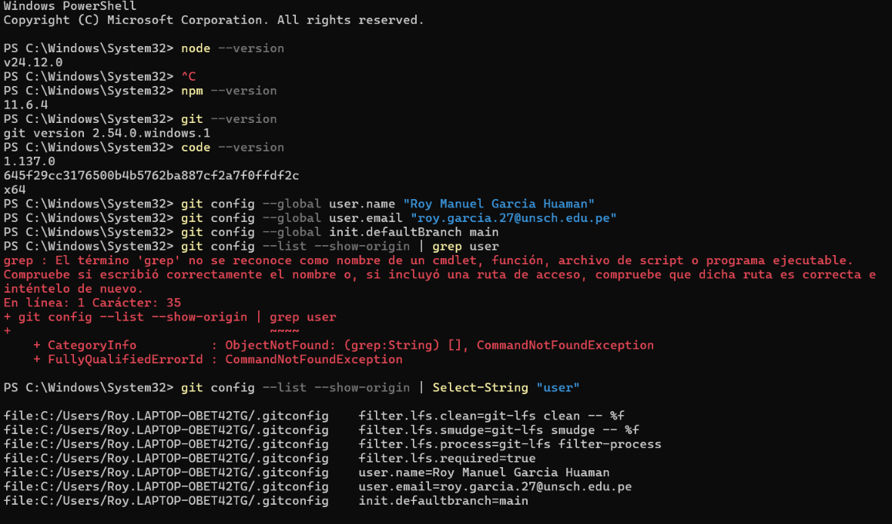
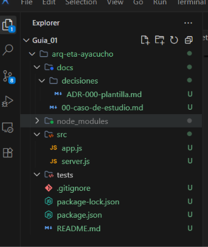

# Arquitectura de Software — Guía 01

## Estudiante
Roy Manuel Garcia Huaman

## Descripción del curso
IS-488 Arquitectura de Software es un curso donde se aprende a tomar y documentar
las decisiones estructurales de un sistema de software: cómo se organizan sus
componentes, cómo se relacionan entre sí, y cómo se atienden aspectos como
seguridad, rendimiento, disponibilidad, escalabilidad y mantenibilidad.

## Expectativas
Mi espectativa del curso es entender de mejor manera la arquitectura de software
como base para el desarrollo de proyectos más complejos y mantenibles, y lograr aplicarlo a mis proyectos personales, mejorando la calidad y escalabilidad de los mismos

## Docente
Ing. Lizbeth Jaico Quispe

## Evidencias

